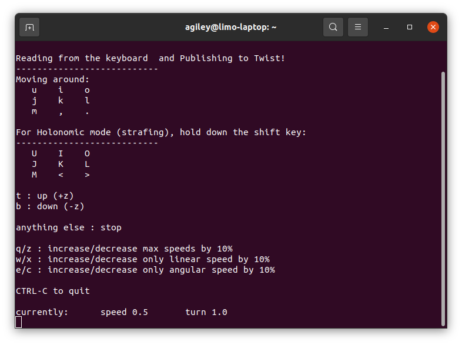
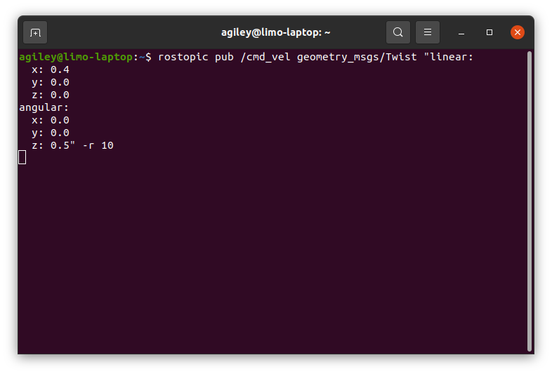

Controlling a Real Limo
=======================

.. note::

    If you are working with a real limo instead of a simulation, make sure you check out :doc:`Starting Limo <starting_limo>` and :doc:`Networking <networking>`

Below is a list of common ways to control your Limo.  This isn't a complete list, but will get you moving without any extra hardware

Keyboard Control
----------------

This is a simple package that uses your keyboard to send twist commands to your platform.  Install it with:

.. code-block:: bash
    
    sudo apt install ros-noetic-teleop-twist-keyboard 

Once it is installed, you can run it with:

.. code-block:: bash

    rosrun teleop_twist_keyboard teleop_twist_keyboard.py

As long as the terminal running the command above **is the active window**, your key presses will drive the platform.

RVIZ Control
------------

Terminal Control
----------------

This is the least intuitive way to control, but is an easy way to test basic functionality of your robot.  It is also how nodes will control the robot autonomously

In a termnal, run the command below

.. code-block:: bash

    rostopic pub /cmd_vel geometry_msgs/Twist "linear:
        x: 0.0
        y: 0.0
        z: 0.0
    angular:
        x: 0.0
        y: 0.0
        z: 0.0" -r 10

Do not copy and paste the code above.  Start typing it manually, then use the `tab` key to auto fill in the rest

The '-r' at the end will cause the command to be resent 10 times per second.  This is needed because the robot's controller will stop driving if it doesn't receive regular commands

Specify a linear x to drive the robot forwards or backwards and an angular z to have the robot turn.