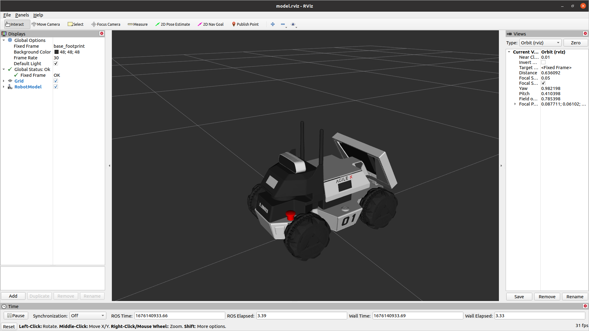
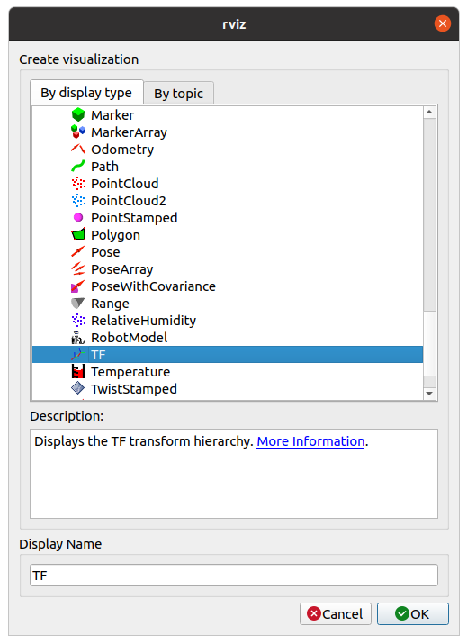
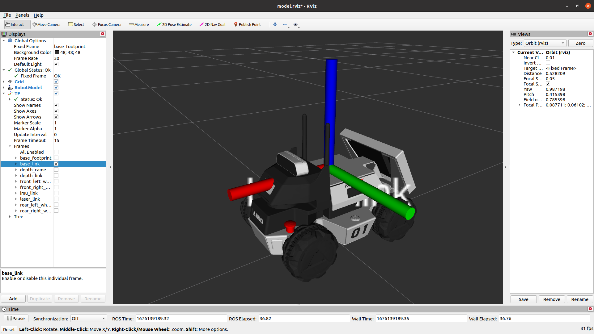
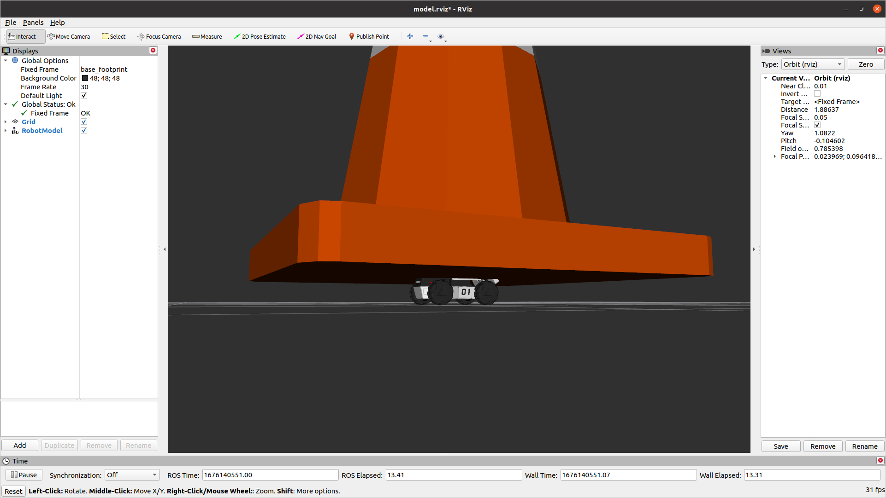
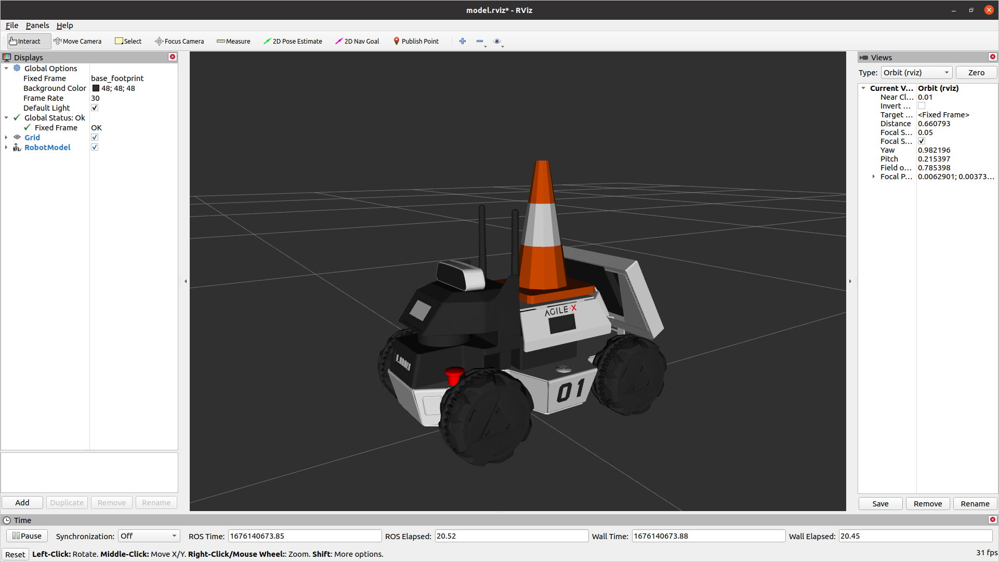

Customizing Limo's URDF
=======================

We're going to customize the robot's view of itself. This will control how it is displayed in RVIZ and can be used for collision detection.  This is a basic example, but it can be extended to new sensors, manipulators, etc.

Make sure you've followed the :doc:`Developer Machine Setup <developer_machine_setup>` before starting this section

Pick a Mounting Point
---------------------

We're first going to look at the default Limo model to decide where we want to mount our new hardware

.. code-block:: bash
    
    roslaunch limo_viz view_four_diff_model.launch

This will show a static version of the URDF that the robot is using.

To visualize the individual frames that make up the robot, under Add in the bottom-left, select TF out of the list

That will display all of the Transform Frames in use.  This can get really messy to see, so expand TF, and under Frames, un-check all of them except `base_link`.  That will show only the link we will use for our attachment

Create your URDF
----------------

You can create a whole new package for this if you are comfortable with ROS.  For simplicity, we are going to expand the `limo_description` package.

Download the cone model from `HERE <_static/cone.dae>`_ (Right-click and save link as).  Take the downloaded file and move it into the "meshes" folder under limo_description.

Next, create a new text file under the "urdf" folder in limo_description and call it "cone.urdf.xacro".  Open that file with your favourite text editor and past in the text below

.. code-block:: xml

    <robot name="cone" xmlns:xacro="http://ros.org/wiki/xacro">
        <link name="cone_link">
            <visual>
                <origin xyz="0 0 0" rpy="0 0 0" />
                <geometry>
                    <mesh filename="package://limo_description/meshes/cone.dae" />
                </geometry>
            </visual>
            <collision>
                <origin xyz="0 0 0" rpy="0 0 0" />
                <geometry>
                    <mesh filename="package://limo_description/meshes/cone.dae" />
                </geometry>
            </collision>
        </link>

        <joint name="cone_joint" type="fixed">
            <parent link="base_link"/>
            <child link="cone_link"/>
            <origin xyz="0 0 0" rpy="0 0  0" />
        </joint>
    </robot>

This file is an XML file.  It has 2 tags, link and joint.  A link is a rigid body.  It doesn't strictly need to have any mass or volume.  The other important tag is a joint.  This is the way that links are connected together.  It could be a static joint (like glue or a bolt) or it could be a controlled joint (revolute, linear, etc)

Our urdf has a static (fixed) joint that connects a link called "cone_link" to "base_link".  It currently has no offset from the normal base_link.  It also has a dae file to give a visual shape to the link and the same dae to calculate collisions.

Add it to the Limo
------------------

The limo has a line in the URDF that allows simple modification.  This will include nothing by default, but if a URDF is specified at the `URDF_EXTENSION` environment variable, it will include it

.. code-block:: xml
    
    <xacro:include filename="$(optenv URDF_EXTENSION empty.urdf)" />

To set the environment variable, past the line below into your terminal

.. code-block:: bash
    
    export URDF_EXTENSION=$(catkin_find limo_description urdf/cone.urdf.xacro --first-only)

This will use catkin to find the limo_description package and then return the filepath for urdf/cone.urdf.xacro.  All of that will be saved in the `URDF_EXTENSION` environment variable

URDF Adjustments
----------------

The geometry for this cone is much too large for our limo.  Add the `scale` property to each geometry tag to scale it down

.. code-block:: xml

    <geometry>
        <mesh filename="package://limo_description/meshes/cone.dae" scale="0.07 0.07 0.07"/>
    </geometry>

That makes the cone a much better size, but it is still hitting the antennas.  We want to shift it back slightly.  We could move the visual and collision geometry back, but then the cone won't line up with its frame anymore.  It's better to shift the joint that connects the cone to the robot.

.. code-block:: xml

    <joint name="cone_joint" type="fixed">
        <parent link="base_link"/>
        <child link="cone_link"/>
        <origin xyz="-0.03 0 0" rpy="0 0  0" />
    </joint>

Gazebo
------

When running a simulation in Gazebo, it's important that Gazebo knows the physical properties of the object.  It does that through an `inertial` tag within the link tag.  The intertial values vary for each object, but below is a basic "dummy" inertia to start with

.. code-block:: xml

    <inertial>
      <origin xyz="0 0 0" rpy="0 0 0"/>
      <mass value="1"/>
      <inertia
        ixx="1.0" ixy="0.0" ixz="0.0"
        iyy="1.0" iyz="0.0"
        izz="1.0"/>
    </inertial>

       