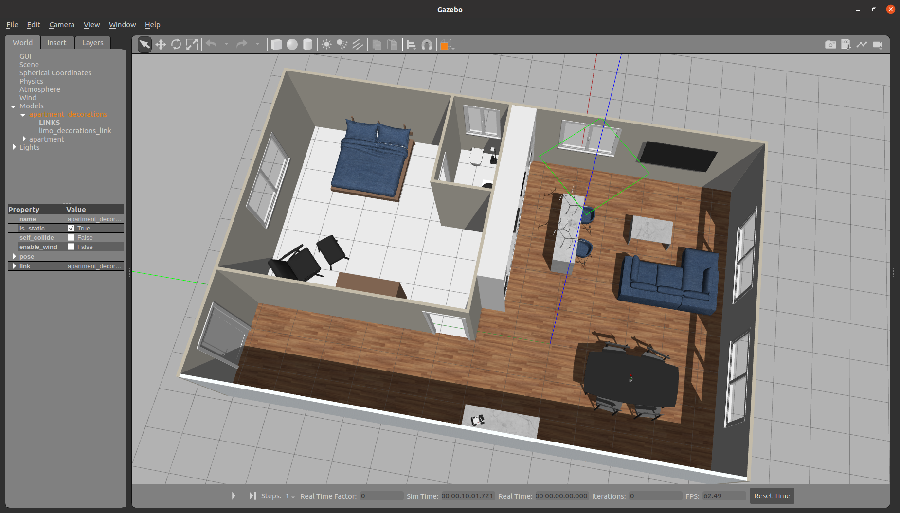

Simulating Limo
===============

The limo_gazebo package has a pre-made environment for testing.

Building Simulation Packages
----------------------------

.. code-block:: bash

    cd  ~/catkin_ws/src
    git clone git@github.com:limo-agx/limo_simulator.git
    cd  ~/catkin_ws
    rosdep install --from-paths src --ignore-src -y
    catkin_make
    source devel/setup.bash

Starting a Simulation
---------------------

There are two launch files for adding a limo to this environment, either `limo_ackerman.launch` or `limo_four_diff.launch`.  This will spawn a Limo at the origin of the environment with a stereo camera and a 2D lidar.

Once the simulation is started, check out :doc:`Controlling Limo <controlling_limo>` or :doc:`Gmapping Navigation <navigation_gmapping>` to start using it.

Notes
-----

Because of how Gazebo plugins simulate motion controllers, there is an additional node running that publishes zero values constantly.  A twist mux will use this data when no other command messages are being received.  This doesn't exist on the real platform and is only present to make the simulation more accurate to the real hardware